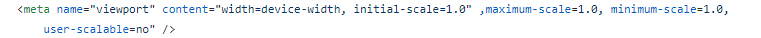

# 简单的介绍网页
运用到以下标签
1. h1 h2标签 
2. a标签 href属性
3. img标签 src属性 alt属性
4. p标签
5. img标签 alt targrt属性
6. table标签 tbody标签 tfoot标签 th tr td属性
7. ol有序列表 li
8. ul无序列表 
9. id属性 class #伪元素 div
10. max width


现在介绍下这些属性分别实现那些文本效果

h1标签用来定义标题 h2标签用来定义章节

p标签用来定义文本

img标签里面的src里面放置图片的地址，alt用来贴加一段提示话语，或者图片在照片加载失败时，才会触发，用一个div把img标签包裹，在img标签外在放置一个a标签，a标签里面也放置这张图片的地址，为的使用户点击超链接时可以看到大图，图片尽力保持一致，注意:给img贴加width或者height属性时尽量只贴加一个，贴加俩个话图片会造成图片比例变形，这种情况是不允许的 下面是个例子
```html
<div><a href="img/1.png" target="_blank"></a></div>
```
table表格标签 先放一个table标签，在table的头部在定义一个头部标签thead在thead里放一个tr(一个tr表示一行)，在tr里面再放一个th表(颜色为粗体)在tbody里面定义主题内容，代码如下:
```html
  <thead>
            <tr>
                <th>专辑名</th>
                <th>年份</th>
            </tr>
        </thead>
        <tbody>
            <tr>
                <td>《Monica》</td>
                <td>1984年</td>
            </tr>
            <tr>
                <td> 《爱慕》</td>
                <td>1980年</td>
            </tr>
            <tr>
                <td>《宠爱》</td>
                <td>1995年</td>
            </tr>
            <tr>
                <td>《当年情》</td>
                <td></td>
            </tr>
            <tr>
                <td>《倩女幽魂》</td>
                <td></td>
            </tr>
        </tbody>
    </table>

```


    ol 有序列表 里面一般都定义些时间排序的内容里面用li来定义
```html
 <ol>
        <li><a href="#b">电影方面</a></li>
        <li><a href="#c">成就和荣誉</a></li>
        <li><a href="#d">主要作品</a></li>
        <li><a href="#e">生活照</a></li>
        <li><a href="#f">生平</a></li>
    </ol>
```
在这里面用到了超链接a标签 a标签里面放了伪元素# 你如果想跳转也面只需要给你挑转到标签贴加一个id=#..就可以跳转了 

<h1><a href="#">回到顶部</a></h1>

如果想在手机上显示的很好的话 只需要贴加:

1. maximum-scale=1.0, minimum-scale=1.0, user-scalable=no

2. 把img定义为: max-width: 100%;


       


